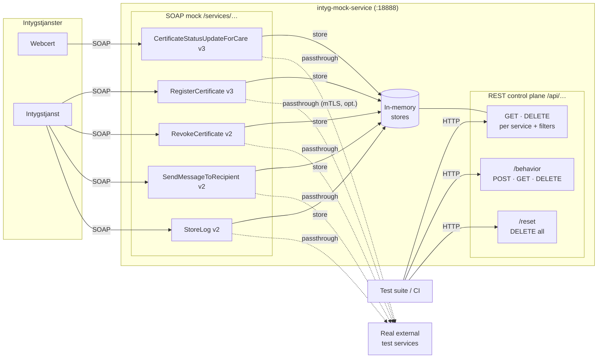
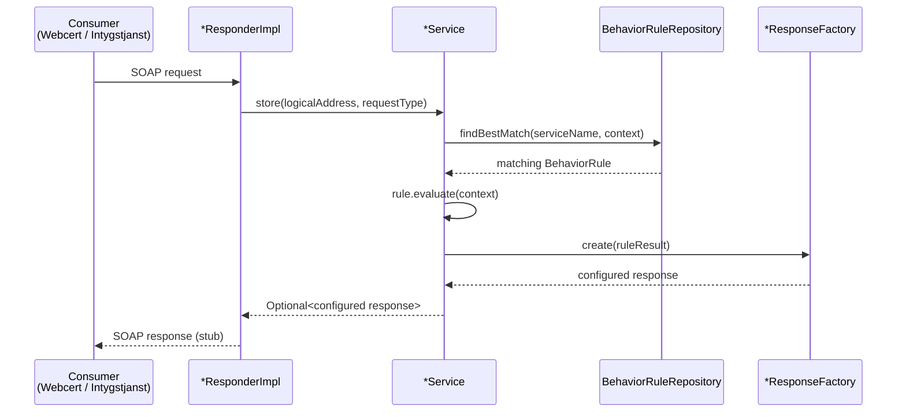
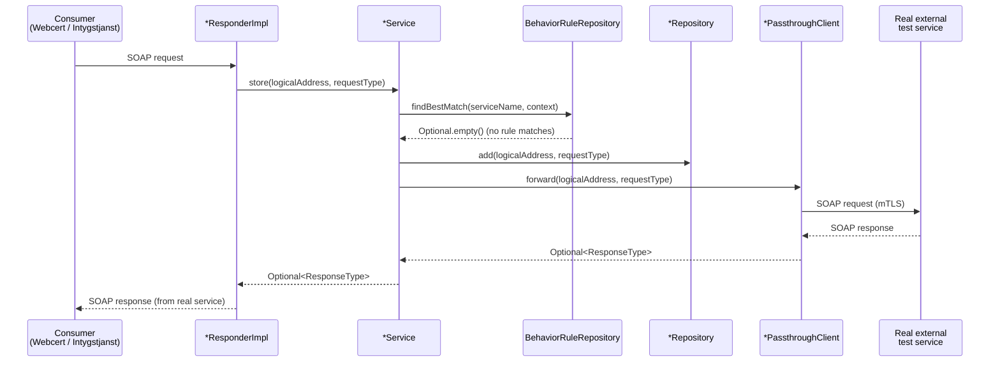

# Intyg Mock Service

Spring Boot application that mocks five RIV-TA SOAP services that Intygstjanster depends on, enabling isolated testing without real external dependencies. Incoming SOAP requests are stored in memory and exposed via REST inspection endpoints. Supports configurable behavior rules for stubbing error responses and delays, and optional passthrough mode to forward requests to real upstream services over mTLS.

## Quick Start

**Prerequisites:** Java 21

```sh
./gradlew build       # Build all modules
./gradlew appRun      # Start on port 18888
./gradlew appRunDebug # Start with debug port 18889
```

Once running:
- **Swagger UI** — [localhost:18888/swagger-ui/index.html](http://localhost:18888/swagger-ui/index.html)
- **CXF services list** — [localhost:18888/services](http://localhost:18888/services)

## Configuration

### Repository sizes

Each service stores up to 1000 messages by default (FIFO eviction). Override per service:

```yaml
app:
  repository:
    register-certificate:
      max-size: 5000
    store-log:
      max-size: 500
```

### Passthrough mode

Passthrough forwards SOAP requests to a real upstream service while still storing them locally for inspection. Enable per service:

```yaml
app:
  passthrough:
    register-certificate:
      enabled: true
      url: https://upstream-host/services/clinicalprocess/healthcond/certificate/RegisterCertificate/3/rivtabp21
```

Available services: `register-certificate`, `revoke-certificate`, `send-message-to-recipient`, `certificate-status-update-for-care`, `store-log`.

If the upstream service requires mutual TLS, activate the `mtls-enabled` Spring profile (see below).

### mTLS

Activated by the `mtls-enabled` Spring profile. Configure certificate and truststore paths:

```yaml
app:
  passthrough:
    mtls:
      certificate-file: /path/to/client.p12
      certificate-password: changeit
      certificate-type: PKCS12
      key-manager-password: changeit
      truststore-file: /path/to/truststore.jks
      truststore-password: changeit
      truststore-type: JKS
```

### Behavior rules

The `/api/behavior` REST endpoint lets you configure mock responses at runtime — error codes, custom result text, and artificial delays. Rules can optionally match on logical address, certificate ID, or person ID, and can be limited to trigger a set number of times. See [Swagger UI](http://localhost:18888/swagger-ui/index.html) for full request/response schemas.

## Local Development vs Kubernetes

### Local

`./gradlew appRun` activates the `dev` profile automatically. Dev-specific config lives in `devops/dev/config/application-dev.yml` (sets port 18888 and disables ECS structured logging). To enable passthrough or mTLS locally, add the properties to that file and set `SPRING_PROFILES_ACTIVE=dev,mtls-enabled`.

### Kubernetes

Build the Docker image using the project `Dockerfile`. Configuration is supplied via environment variables or ConfigMaps using Spring Boot's relaxed binding:

| YAML property | Environment variable |
|---|---|
| `app.passthrough.register-certificate.enabled` | `APP_PASSTHROUGH_REGISTERCERTIFICATE_ENABLED` |
| `app.passthrough.register-certificate.url` | `APP_PASSTHROUGH_REGISTERCERTIFICATE_URL` |
| `app.repository.register-certificate.max-size` | `APP_REPOSITORY_REGISTERCERTIFICATE_MAXSIZE` |

Activate mTLS by setting `SPRING_PROFILES_ACTIVE=mtls-enabled` and mounting certificate/truststore files into the container.

## Configuring Intygstjanster

| Application  | SOAP Webservice                | Local environment (application-dev.properties)    | Test environment (configmap.yaml)                 |
|--------------|--------------------------------|---------------------------------------------------|---------------------------------------------------|
| Webcert      | CertificateStatusUpdateForCare | certificatestatusupdateforcare.ws.endpoint.v3.url | CERTIFICATESTATUSUPDATEFORCARE_WS_ENDPOINT_V3_URL |
| Intygstjanst | RegisterCertificate            | registercertificatev3.endpoint.url                | REGISTERCERTIFICATEV3_ENDPOINT_URL                |
| Intygstjanst | RevokeCertificate              | revokecertificatev2.endpoint.url                  | REVOKECERTIFICATEV2_ENDPOINT_URL                  |
| Intygstjanst | SendMessageToRecipient         | sendmessagetocarev2.endpoint.url                  | SENDMESSAGETOCAREV2_ENDPOINT_URL                  |

## Architecture



## Request Flow

### Mock mode

A behaviour rule is configured via `/api/behavior`. When a SOAP request arrives and the rule
matches, the service returns the configured stub response immediately — no storage, no forwarding.



### Passthrough mode

Passthrough is enabled per service via `app.passthrough.<service>.enabled=true`. The request is
stored locally (for inspection) and then forwarded to the upstream service over mTLS. The real
service's response is returned to the caller.



## Development

```sh
./gradlew :app:test                          # Unit tests
./gradlew :integration-test:integrationTest  # Integration tests
./gradlew spotlessApply                      # Auto-format (Google Java Format)
./gradlew spotlessCheck                      # Check formatting
```
