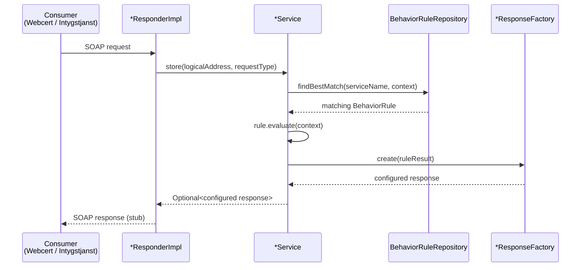
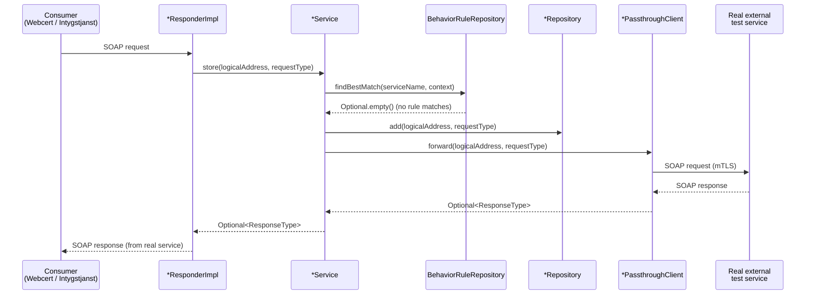

# Intyg Mock Service

## Overview

The Intyg Mock Service is a Spring Boot application designed to simulate the behavior of services
that Intygstjänster is dependent upon. This in order to make it testable.

## Prerequisites

- Java 21

## Building the Project

To build the project, run the following command:

```sh
./gradlew build
```

## Running the Project

To run the project, run the following command:

```sh
./gradlew appRun
```

## Architecture


## Request Flow

### Mock mode

A behaviour rule is configured via `/api/behavior`. When a SOAP request arrives and the rule
matches, the service returns the configured stub response immediately — no storage, no forwarding.



### Passthrough mode

Passthrough is enabled per service via `app.passthrough.<service>.enabled=true`. The request is
stored locally (for inspection) and then forwarded to the upstream service over mTLS. The real
service's response is returned to the caller.



## Mocked SOAP endpoints

See available cxfservices at <http://localhost:18888/services>.

## API

See swagger documentation at <http://localhost:18888/swagger-ui/index.html>.

## StoreLog Mock

The StoreLog mock implements the `se.riv.informationsecurity.auditing.log` RIV-TA SOAP service (v2).
Any call to the SOAP endpoint is stored in an in-memory repository and can be inspected or deleted via the REST API.

### SOAP endpoint

```
POST /services/informationsecurity/auditing/log/StoreLog/v2/rivtabp21
```

### REST API

| Method   | Path                                  | Description                                                  |
|----------|---------------------------------------|--------------------------------------------------------------|
| `GET`    | `/api/store-log`                      | Retrieve all stored audit log entries                        |
| `GET`    | `/api/store-log/user/{userId}`        | Retrieve all entries for a specific user ID                  |
| `GET`    | `/api/store-log/certificate/{certId}` | Retrieve all entries for a specific certificate ID           |
| `DELETE` | `/api/store-log`                      | Delete all stored audit log entries                          |
| `DELETE` | `/api/store-log/user/{userId}`        | Delete all entries associated with a specific user ID        |
| `DELETE` | `/api/store-log/certificate/{certId}` | Delete all entries associated with a specific certificate ID |

> **Note:** Certificate ID filtering uses the `activityLevel` field from the StoreLog schema.

### Examples

Retrieve all stored logs:

```sh
curl http://localhost:18888/api/store-log
```

Retrieve logs for a specific user:

```sh
curl http://localhost:18888/api/store-log/user/it-user-001
```

Retrieve logs for a specific certificate:

```sh
curl http://localhost:18888/api/store-log/certificate/Enhet
```

Delete logs for a specific user:

```sh
curl -X DELETE http://localhost:18888/api/store-log/user/it-user-001
```

## How to configure Intygstjänster to use the mock service

| Application  | SOAP Webservice                | Local environment (application-dev.properties)    | Test environment (configmap.yaml)                 | 
|--------------|--------------------------------|---------------------------------------------------|---------------------------------------------------|
| Webcert      | CertificateStatusUpdateForCare | certificatestatusupdateforcare.ws.endpoint.v3.url | CERTIFICATESTATUSUPDATEFORCARE_WS_ENDPOINT_V3_URL |
| Intygstjanst | RegisterCertificate            | registercertificatev3.endpoint.url                | REGISTERCERTIFICATEV3_ENDPOINT_URL                |
| Intygstjanst | RevokeCertificate              | revokecertificatev2.endpoint.url                  | REVOKECERTIFICATEV2_ENDPOINT_URL                  |
| Intygstjanst | SendMessageToRecipient         | sendmessagetocarev2.endpoint.url                  | SENDMESSAGETOCAREV2_ENDPOINT_URL                  |
